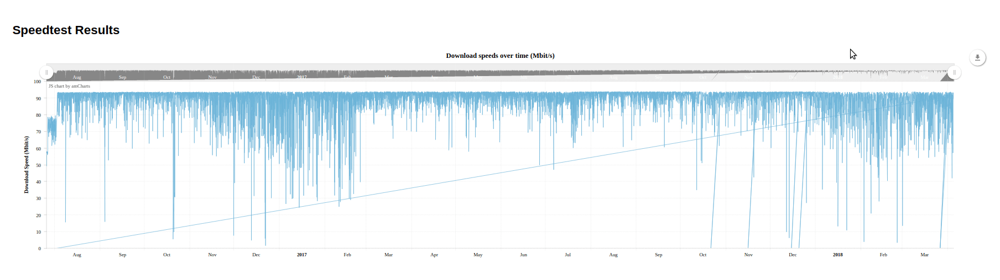

# Speedtest Visualization

This project reads data from a local Postgres database, and visualizes it as an interactive serial time chart using AmCharts.
Speedtest results are cleaned, and placed into the database every hour via a cron job.

Demo:

